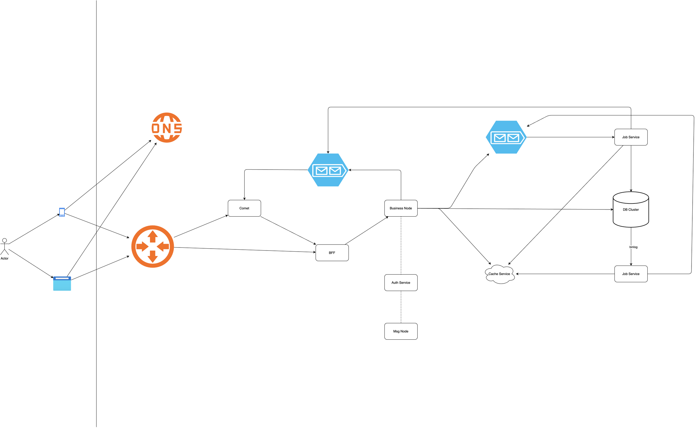
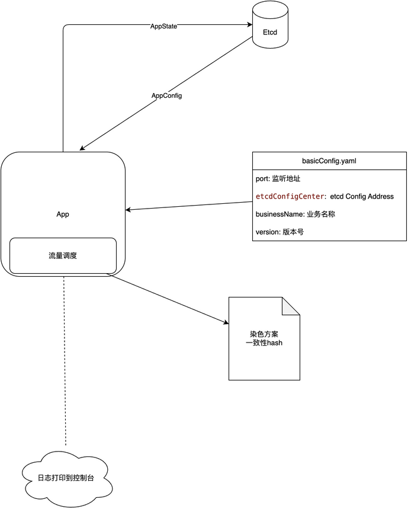
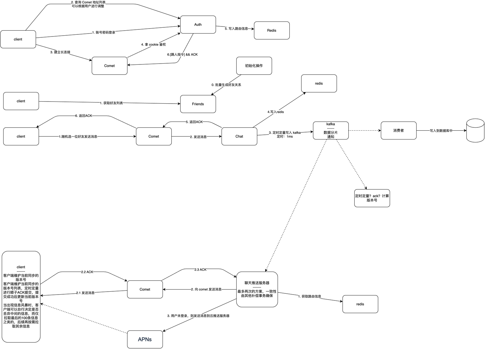
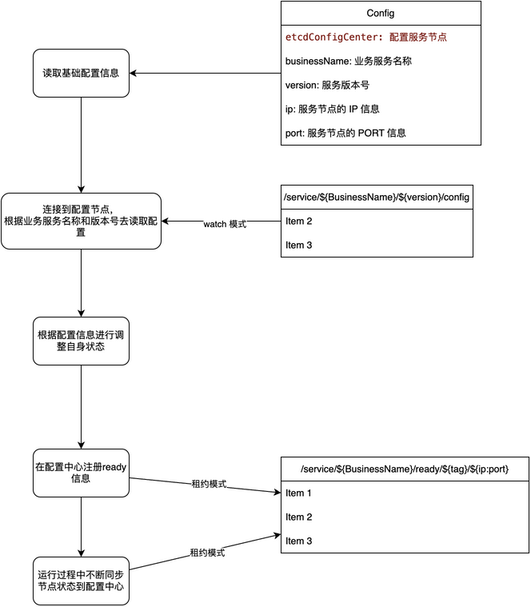
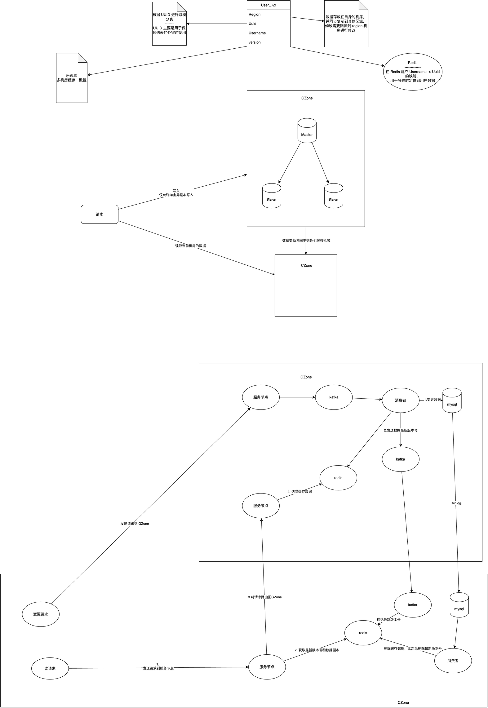
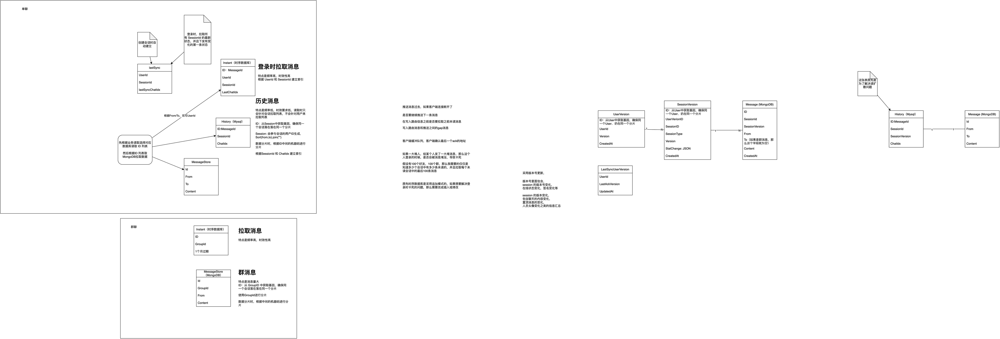

- [distribute-im-gateway](#distribute-im-gateway)
- [整体架构：](#整体架构)
- [应用运行:](#应用运行)
- [流程图：](#流程图)
- [配置读写:](#配置读写)
- [用户数据：](#用户数据)
- [消息存储](#消息存储)

# distribute-im-gateway

# 整体架构：  

---
# 应用运行:  

---
# 流程图：

---  
# 配置读写:  

---  
# 用户数据：  

---
# 消息存储

What would like to support:
Comet:
-- Connection Layer:
---- Websocket
---- TCP
-- Room Management
Lib Framework:
-- Traffic Shaping
